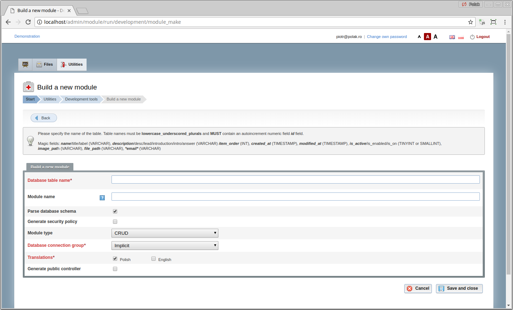

# Generating a CRUD module

1. Execute SQL DDL against the database. You can use a bundled `SQL console` module.
2. Navigate to `Start > Utilities > Installed modules > Build a new module`
3. Provide mandatory `database table name` and optional module details:

    
    * Module name - leave empty to keep default name equal to the database table name
    * Whether to parse database schema
    * Whether to generate implicit security policy
    * Module type (CRUD or Default/basic)
    * Database connection (if you have multiple databases configured)
    * Languages for generating translation files
    * Whether to generate a public controller
    
4. Proceed
5. Customize translations (optionally)
6. Customize generated controller code (optionally)
7. Upload custom icons (optionally)

You can find a sample SQL file to play with at [sql/sample.sql](sql/sample.sql).