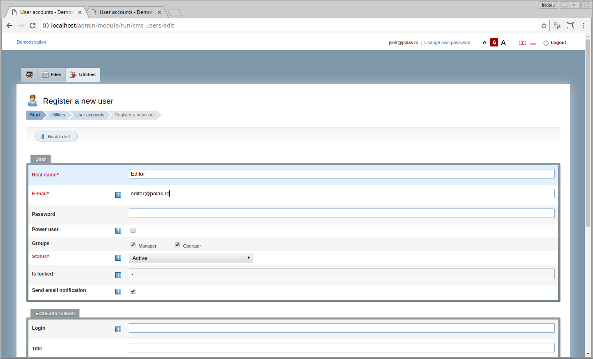

# Built-in modules

There are two types of modules:

* system modules - those modules are bundled within the system and are upgraded when PepisCMS version is upgraded
* user modules - user space modules, those are specific to instance of your application

By default all modules are disabled and must be manually installed (during PepisCMS installation or at any later point).

## Module structure

* Module descriptor
* Admin controller (optional)
* Public controller (optional)
* Admin views (optional)
* Public views (optional)
* Models (optional)
* Libraries (optional)
* Language files
* Security policy (`security_policy.xml`)
* Additional resources (like default icons: `<module_name>/resources/icon_16.png` and `<module_name>/resources/icon_32.png`)

## Module installation

An SQL code can be executed upon module installation/uninstallation. A file containing SQL code can be optionally
specified in module descriptor.

To view installed modules please navigate to `Start > Utilities > Installed modules`.

## Built-in modules

### Groups

An utility for managing user groups and groups access rights.

### User accounts

An utility for managing and registering new users.

### Development tools

### System logs

### SQL conole

### Symfony2 bridge

### Translator

### Backup

### CRUD

### Dmesg

### HTML customization for admin panel

### Remote applications

### System information

### XML-RPC consumer demo

### XML-RPC service