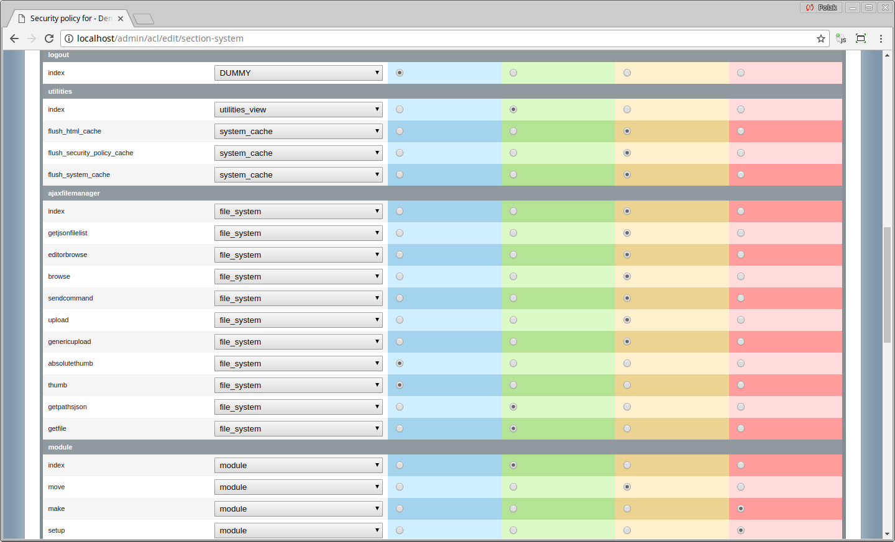

# Security policy

Security policy is a set of required user rights above certain entities required to access a controller's method.
The user is granted one of the four access rights above above the defined entities

## Entities

An entity is just a string representing the core business object. When a security policy is created,
the administrator first defines desired entities (such as `page`, `user`, `group`, `configuration` etc.)
and assigns the entities to methods of controllers.

## Possible access levels

There are four access levels:

* `NONE`
* `READ`
* `WRITE`
* `ALL`

Also see [groups module](MODULES.md#groups)

# Controllers, methods and reflection

Every controller method for which a security policy is defined has associated a minimal required access right above an
entity.

A reflection mechanism is used to scan for the controller methods.

# Changing security policy at runtime

Security policy can be changed at any time without need to change code or recompile anything.
`AdminControllers` initializes `SecurityManager` that handles security transparently to the programmer or user of the
system.

# Marshaling a security policy and caching

Security policy is serialized onto XML file that is platform independent and can be manually edited.
In order to reduce time needed for parsing XML file with each request,the security policy is storied in a processed and
serialized cached format on the permanent storage or directly in the memory.

See [security policy file for the core](pepiscms/application/security_policy.xml) and a sample module policy
[user accounts](pepiscms/modules/cms_users/security_policy.xml).

## Types of security policy

There are two types of security policy:

* System security policy
* Module security policy

All violations of security policy are reported using system logs.

## User groups 

Once the security policy is created for both core and modules the administrator can create user groups.
Creating a group is process similar to building security policy - the administrator picks an access level for every
single entity that is granted to anyone who belongs to the group.

A single user can belong to any number of user groups. This offers high flexibility because you can manage the groups
separately. 